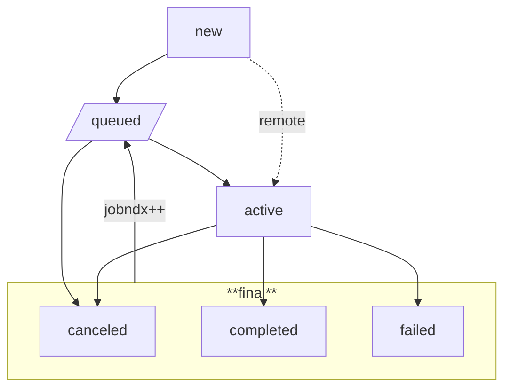

---

title: Psik: Seamlessly Managing Remote Jobs
author: David M. Rogers
date: Oct. 31, 2025

---

# Introduction

Running a compute job on a remote high-performance computing
(HPC) system is typically
done by opening a shell session to the login node,
discovering, installing, and testing a software environment,
submitting a job to the batch queue, and then checking
back often (or waiting for an email notification) to find
out about the status of the job.  All these steps are intimately
linked to manual interactions with the system's shell.

The advent of cloud computing has changed this picture
somewhat.  Instead of manually logging into a monolithic
remote system, users typically build their software environment
in a container suitable for their target hardware.  Then,
this container, along with a command to run, is sent to a
cloud API.  The user still manually checks back to find the status
of the container's result.  However, on success, the containerized
job itself usually sends its data to a cloud-backed data store.
Additionally, the container can send its logs through
API calls.  Services like Airflow can read these logs,
or listen for specific callbacks, and trigger follow-on work.

The ASCR Integrated Research Infrastructure (IRI) program
has the goal of making the connections between data and compute
more seamless for DOE researchers.  Given that DOE-ASCR's
HPC systems are mostly monolithic systems managed by the
SSH-access process, seamless access to compute requires key
interfaces and infrastructure that does not exist.

Simple job launch with cloud-like monitoring features
is one of the foundations on which IRI must be built.
In particular, how is a user of scientific computing meant
to accomplish the following tasks?

- Setup a computing environment suitable for a remote HPC system
  (either containerized or inheriting from system modules)?

- Submit, check status, and cancel a job in an HPC system queue?

- Remotely access job logs and dispatch on job status events.

- Retrieve job results or send to a data store.

At present, there is no set of well-known conventions for
setting up job environments or remotely monitoring and logging
job status events and logs.
Submitting and polling jobs and files is somewhat supported.
ASCR HPC systems have various different REST-APIs
defined for accessing jobs and files -- Superfacility API at NERSC,
Globus Compute at ANL, and S3M at OLCF.  Unfortunately no
single client library can interoperate with all of them.

<!-- note principles:
     - building the language up to the
       level you can express what you want to do
       / see also Viewpoints Research Inst.

     - interpreters and metacircular evaluation
       - quoting concepts and Godel Escher Bach
  -->
That this interoperability is very much needed is illustrated
by IRI applications projects like [splash-flows](https://als-computing.github.io/splash_flows/).
There, separate client implementations for Globus and NERSC
occupy (<!--nn-->) lines of code.  The need for re-structuring
the main workflow depending on the backend used shows
the difficulty of working with competing conventions.

This work presents a client library providing top-level
interfaces and conventions for carring out all four of
the tasks above.  Using a novel set of conventions,
it is able to provide a *uniform* user experience
despite working simultaneously with many different job API definitions.
The central new idea is running copies of the
client library on both the client and HPC hosts.

This approach has the following benefits:

1. Job tracking on the client host (including fetching results and receiving
   status updates) works the same regardless of API providers.

2. The job client command and partial job tracking is available at job run-time.
   This enables automatic logging of job events to external APIs.

3. The job's run-environment is dynamically created at job start,
   even on a "clean" system (the client package was not installed prior to running the job).

4. Users can dynamically add new API providers to a client-manged list
   of "backend" definitions.

With this client interface, it is extremely simple to
utilize HPC jobs as part of a larger workflow.
One early example is the LCLStream project, which
runs X-ray image analysis jobs on-demand as experimental
data is being collected.
Another is ML model training and fine-tuning jobs
launched from a remote science gateway.


# Job Client Design

Psik's client interface has three user-facing functions,

- `psik submit <jobspec.json>` -- Submit the given job to the queue of the backend it specifies.

- `psik poll <jobid> [jobid]...` -- For remote jobs, update the local job status directory.
                             For local jobs, do nothing.

- `psik cancel <jobid> [jobid]...` -- Cancel the given jobs.

All three functions can also be run via (zero-argument) methods of a `psik.Job`.
The only piece of information necessary to instantiate a `psik.Job` is the location
of its status directory.

The interface also contains, for convenience,

- `psik ls [jobid]...` -- Read and print the job status from its status directory.

- `psik rm <jobid> [jobid]...` -- Delete a job's status directory.

Internally, jobs are created from a call to `psik.Manager.create`.
`psik.Manager.ls` also allows listing jobs.  Creation just entails creating
the job's directory layout:

```
jobid/
  log/
    console
    stdout.1
    stderr.1
    ...
  work/
    <user files>
  jobspec.json
  status.csv
```

The `jobspec.json` file immutably records the job's
definition.  The `status.csv` records each new state
as it is visited.  Writes and reads to/from this file are made
atomic using writer/reader POSIX file-locking.
This prevents overlap of the `queued` and `active`
transitions, for example.
Initially, the log directory is empty.  Separately named stdout
and stderr files are written for each successive job index
(`jobndx`).
All of psik's own log messages get written to `log/console`.  
These are useful in diagnosing issues during job
launch steps, since they do not appear within the job
output itself.

## Transitions

Psik adopts Psi/J's nomenclature for job states.
However, the state transition diagram differs between the two.
Psik's state transition diagram appears below:



A newly created job (just after writing the directory layout
and its immutable `jobspec.json`) starts in the `new` state.
Submitting that job to a queue creates a transition to the
`queued` state.  However, that transition is visible only
on the submit host, and may be recorded in the transition log
out of time-order.  A running job becomes `active`.

At each transition, a callback is issued.  However, callbacks
are sent only once for each transition.  Callbacks that fail
to `POST`, due to network accessibility or server errors,
are not retried.  The submit host sends the `new` and
`queued` transitions.  The run host sends all other
transition updates.

## Run-time execution

Despite the minimal configuration and simple job scripts,
Psik jobs can run on a variety of hosts out-of-the box.
This is done via backend implementations.  A python module
named for each backend must contain implementations of
`submit`, `cancel`, and `pull`.  These backends are dynamically
loaded and type-checked both as part of psik's tests and
when the configuration file is read.
This facilitates the process of debugging a new backend.

For remote hosts, the `submit` function is usually the most
complicated.  It is responsible for submitting a job
script to that host which expands into the desired job to be run.
Psik accomplishes this with only a single (job-launch) API call,
rather than several calls to install psik remotely,
transfer files, setup directories, and then launch the job.

For example, the following steps are executed within
all jobs submitted to the NERSC backend:

1. Install psik in a fixed location (configurable, usually `$HOME/psik-3.0`),
   if it does not exist there.

  - Create a fixed psik configuration file suitable for the backend system.

  - Unpack a certificate keypair into this directory.

2. Set `CERTIFIED_CONFIG` to point to the certificate keypair above.

3. Run `psik hot-start`, specifying absolute paths for `psik` and its
   configuration file.

The `hot-start` method takes, as input, the original `jobspec.json`
and a string containing the zipped contents of the job's run directory.
It sets up a new job structure (if it does not exist already),
unpacks the working directory, and calls `job.execute`.
That function logs the `active` state, sets up the working environment
(current directory, environment variables, etc.)
and then executes the job script body via `popen`
with all appropriate output re-directions.
On completion, it logs `completed` or `failed` transitions.
It also forwards signals it receives to the job script's
process group.

For job queue systems like SLURM `sbatch` or UNIX `at`,
the submitted job script contains only step 3 (launch psik hot-start).
The job's run directory is not sent, as it already exists in-place.
<!--  Rather than constructing a self-extracting script and sending it to an API
as above -->

The hot-start function obviates the need to rely on
job queuing systems to set up the environment and stdin/stdout
properly.  Instead, the goal of psik is to submit a job
containing `psik hot-start` to the remote system.

This convention has the interesting effect of makeing
the local backend a corner case.
This backend directly runs the script, rather than invoking `hot-start`.
To accomplish this, its submit function forks
a call to `job.execute` directly.  The fork is necessary
to prevent early process termination and facilitate
process group cleanup at job exit.


# Discussion

Psik avoids a proliferation of configuration options
by extensive use of conventions.  Its configuration contains
only a single directory name --the base directory where jobs
are created and managed-- and a set of named backend configuration
specifications.  Although the backend configuration could have
been placed inside the `JobSpec`, this was avoided because
i) backends (representing a project ID and queue settings on
a particular HPC site) are used multiple times, and ii)
configuring these only once significantly simplifies `JobSpec`-s.
In fact, `JobSpec`-s require only one parameter, a `script`.
This keeps with the precedent set by the UNIX "at" utility.

Polling is not necessary within the Psik framework,
since job status notifications can be sent directly from the
compute system out to the user's web application.
However, the poll function allows that web application
to trigger a process to receive the job results.
Used in this way, it is not so much a poll as a download.
If the job is designed to produce large files, the
download can be skipped (default for files >2GB),
and the result used in-place.
It is also very useful for during setup and testing of
more automated methods, as well as error recovery.

Despite its uniform user interface, Psik does not provide
a uniform method for authentication and authorization.
These tasks are necessarily handled by
deferring to the authentication mechanisms of each
Psik backend.  Usually this is done by setting environment variables
or configuration files in the user's home directory.
For example, the Superfacility API reads a token from the file
`$HOME/.superfacility/key.pem`.  The S3M API reads a token
from the variable `OLCF_TOKEN`.  Globus compute relies
on two environment variables `GLOBUS_COMPUTE_CLIENT_ID`
and `GLOBUS_COMPUTE_CLIENT_SECRET`, but also caches tokens
in `$HOME/.globus_compute`.  Psik-API reads a client TLS
certificate from `$VIRTUAL_ENV/etc/certified` when run over https,
or uses unuthenticated access when run through an SSH-tunnel
to a UNIX domain socket.

No shell scripts are templated.  Removing the template
substitution step makes the submission process easier
to debug, since there is no intermediate state between
the jobspec and its execution.
Template substitution is also a well-known source of security
vulnerabilities.

Forwarding signals received to a job script's process
group differs from the behavior of most job control systems.
The usual behavior would be to forward only to the script
itself, not subprocesses it has created.
Forwarding to the whole group makes it much easier to
carry out checkpoint-restart operations.
Usually job scripts launch a long-running
program executable (e.g. with srun, etc.).
That long-running executable needs to be signaled
if the job is running out of time so that it can
write a checkpoint -- saving duplication of work.

Without forwarding to the whole group, job scripts must be written
in a complicated way to handle and forward the signal
to that executable themselves.
Whether they launch a separate executable or not,
all of the job's subprocesses can now receive the
same signal -- allowing them to simultaneously
begin gracefully shutting down.


# Conclusion

This work described Psik, a client library accomplishing
interoperable job management on local and remote HPC
centers.  Psik offers richer interfaces
for diagnosing jobs than the bare features provided by job
APIs -- including state transition logs, automatic callbacks,
job iteration indices, job step error and output logs,
and `poll` functions for fetching job outputs.

Besides standard modeling and simulation jobs, it has been applied
to on-demand X-ray analysis and remotely managed ML model training.
The latter two application use cases involve an
external API that both interacts with their user and
is responsible for receiving callbacks from the job.
Going forward, this pattern (API to API interaction)
is likely to dominate API-based job submissions.

It is even possible to use Psik to launch remote jobs on
HPC centers that provide only SSH access.  This is done
by SSH-tunneling to a userspace API process (e.g. Psik-API
or Globus Compute) run by the user on an HPC node.
Psik-API differs from Globus Compute in that it does not
rely on a third-party cloud service.  This has both privacy
and setup benefits.  A Psik-API process can be launched and
an SSH tunnel setup in a single command.  For HPC systems
offering Kubernetes integration, the API can also be run there.

On the job-level, this work removes many of the
most difficult roadblocks to making use of large-scale
high-performance compute jobs within API-driven workflows.
Challenges remaining include i) handling large files (>2 GB) efficiently,
ii) key distribution, and iii) authorization.
Globus has traditionally solved i. for the HPC community,
but needs support for decentralized authentication and
and improved asynchronous notifications.
Tapis has a solution for ii and iii that is worth
re-implementing in the IRI context.
